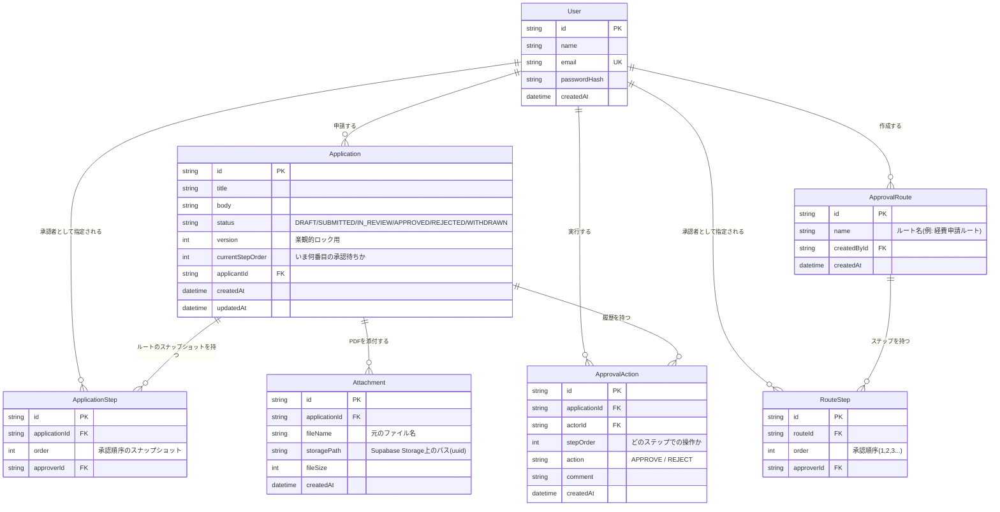
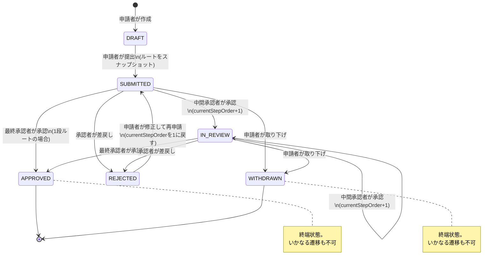

# hanko-buster 設計ドキュメント

CLAUDE.md のセクション 4-3(状態遷移)と 5(データモデル)を図に起こしたもの。

---

## 1. ER図

### ER図のポイント

- **RouteStep と ApplicationStep は似ているが役割が違う。**
  RouteStep は「テンプレート」、ApplicationStep は「申請時点のコピー(スナップショット)」。
  申請後にテンプレートを編集しても、進行中・過去の申請には影響しない(CLAUDE.md 5)。
- **Application は ApprovalRoute への FK を持たない。**
  申請時に RouteStep を ApplicationStep へ複製した時点で、テンプレートとの縁は切れる。
  (「どのテンプレートから作ったか」を記録したければ nullable の参照を足してもよいが、MVPでは不要)
- **ApprovalAction は追記のみ(append-only)。** UPDATE / DELETE しない。監査性の根幹。
- **currentStepOrder** で「いま誰の承認待ちか」を判定する。
  承認待ち一覧 = 「自分が approver の ApplicationStep があり、その order が
  Application.currentStepOrder と一致し、status が承認待ちである申請」。

---

## 2. 状態遷移図

### 状態遷移のポイント

- **遷移の可否判定は `src/domain/application-status.ts` に一元化する**(CLAUDE.md 4-3)。
  UIでボタンを出し分けるだけでは防御にならない。
- 承認は「現在ステップの承認者本人」だけが実行できる。
- 差戻し(REJECTED)は途中のどのステップからでも可能で、再申請時はステップ1からやり直す。
- 取り下げ(WITHDRAWN)は申請者本人のみ、最終承認前のみ可能。
- DRAFT の削除は物理削除でよい(まだ誰の目にも触れていないため)。
  提出後の申請は削除せず状態で表現する(CLAUDE.md 8)。

---

## 3. 検討して決めた論点

1. **SUBMITTED と IN_REVIEW を分ける必要はあるか?**
   「1件も承認されていない」か「1件以上承認済み」かの違いだけなら、
   `PENDING` 1つに統合し currentStepOrder で表現する簡略化もあり得る。
   分けるメリット: 一覧での表示が分かりやすい。
   統合するメリット: 遷移パターンが減り実装が単純になる。
   今回は「自分の出した申請が、今どんな状況なのかわかりやすくする」というユーザー体験を重視し、分けることとする。
2. **同一ルート内に同じ承認者が2回登場するのを許すか?**
   MVPのためシンプルに禁止とする。
   多層防御の観点から、DBのユニーク制約(@@unique([routeId, approverId]))でも守る。
3. **再申請は同じ Application レコードを使い回すか、新規レコードにするか?**
   新規レコードのメリット: 「差戻し前の本文の内容」がそのまま残る。
   使い回しのメリット: データベースの中のデータが1個で済むので、システムが非常にシンプルで作りやすい。
   MVPに最適なのは使い回しと判断したため使い回しとする。
4. **ログイン形式はOAuthか、Credentialsにするか？**
   Auth.jsはCredentialsプロバイダを使うと、セッション戦略が実質JWT一択になる。(database戦略はCredentialsと組み合わせられない仕様)。
   hanko-busterは「社内の決裁システム」というペルソナのアプリです。この手の業務システムは管理者がアカウントを発行してID/パスワードで入るのが現実の姿なので、プロダクトの世界観と一致します。面談でのデモを考えても効きます——「申請者用と承認者用のデモアカウントを用意したので触ってみてください」ができる。GitHub OAuthだと面接官のGitHubアカウントに依存してしまい、複数ロールの切り替えデモもやりにくい。さらにUserテーブルに既にemail/passwordHashを持たせているので、スキーマとも整合します。
5. **認証応答のタイミング攻撃対策(対応済み)**
   ユーザー不在なら即null、存在すればbcrypt.compare(数十ms)の後にnullという実装だと、
   応答時間の差からemailの登録有無を外部から推測できてしまう(ユーザー列挙攻撃)。
   対策として、ユーザー不在時も固定のダミーハッシュに対してbcrypt.compareを実行し、
   どちらの失敗経路でも所要時間をほぼ揃える(auth.tsのDUMMY_HASH)。戻り値はどちらもnullで変わらない。
6. **JWT戦略の既知の弱点: セッションの即時失効不可(未対応・許容中)**
   セッションの実体が署名付きCookieであるため、サーバー側から特定ユーザーのセッションを
   即時無効化できない。退職者や権限剥奪者のアクセスを有効期限切れまで遮断できないリスクがある。
   社内数十人規模のMVPでは許容できると判断し、現段階では対応しない。
   将来必要になった場合の選択肢: (a) トークンを短命化し定期更新させる、
   (b) jwtコールバック内で毎回ユーザーの存在・有効性をDBチェックする(JWTの利点は一部失われる)。
6. **Supabase プロジェクト作成時のセキュリティ設定について**
   すべての初期API・セキュリティ自動生成機能を OFF とする。
   Enable Data API → OFF
   Automatically expose new tables → OFF
   Enable automatic RLS → OFF
   採択の理由（アーキテクチャ設計との整合性）
   本システムは 「Next.js（Server Actions） + Prisma」 の構成を採用しており、データベースへのアクセスおよび認可（アクセス制御）の責務はすべて Next.jsのサーバー層（アプリケーション層） に集約する設計となっている。
   Enable Data API & Automatically expose new tables（OFF）
   理由: ブラウザから supabase-js を用いて直接DBを操作する構成ではないため、自動生成されるREST APIは一切使用しない。使用しない不要なエントリーポイント（攻撃面）を排除し、アタックサーフェスを最小限に抑えるセキュリティファーストの観点から無効化する。
   Enable automatic RLS（OFF）
   理由: 認可の関所はサーバー層（auth() によるセッション確認およびServer Actions内での権限チェック）に置いて制御するため、DB層でのRLS（行レベルセキュリティ）は不要となる。また、Prisma経由の接続はDBのオーナー権限（バイパス）となるため実質的にRLSを素通りする。マイグレーションのたびに不要なイベントトリガーが走るノイズを避けるため、最初から無効化を選択する。
   7. **seed警告・保留中**
   ExperimentalWarning及び、MODULE_TYPELESS_PACKAGE_JSON Warning。「package.jsonに "type": "module" を足せ」とのこと。
   8. **TZについて**
   業務日付のTZはJST固定。国内向け業務用アプリのため。